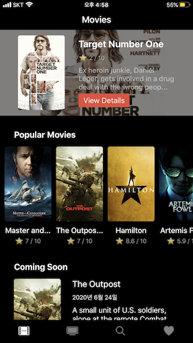
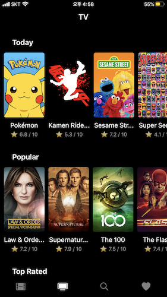
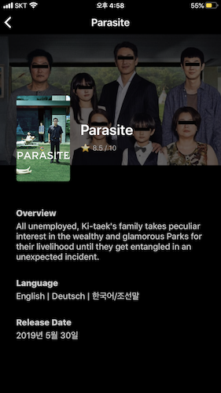

# RNetflix

## Introduce

- This project is for practice using React Native(RN), and I try to cloning Netflix mobile application. So I named this RNetflix, that is RN + Netflix
- mainly using ReactJS, React Native, Expo
- The Movies DB produced all of Movie/TV data in this project, thanks
- This practice project based on NomadCoder lecture

## Screenshots








## What I want to show you in this project especially

### Card Animation


```javascript
const nextCard = () => setTopIndex((currentValue) => currentValue + 1);
const position = new Animated.ValueXY(); // React Supported!
const panResponse = PanResponder.create({ // for Element's Attr
  onStartShouldSetPanResponder: () => true,
  onPanResponderMove: (evt, { dx, dy }) => { // Move Event
    position.setValue({ x: dx, y: dy });
  },
  onPanResponderRelease: (evt, { dx, dy }) => { // Release Event
    if (dx >= 150) { // Swpied right side
      Animated.spring(position, {
        toValue: { x: WIDTH + 100, y: dy },
        useNativeDriver: true, // this option make performance better
      }).start(nextCard);
    } else if (dx <= -150) { // Swiped left side
      Animated.spring(position, {
        toValue: { x: -WIDTH - 100, y: dy },
        useNativeDriver: true,
      }).start(nextCard);
    } else { // Place the card to original position
      Animated.spring(position, {
        toValue: { x: 0, y: 0 },
        useNativeDriver: true,
        bounciness: 10,
      }).start();
    }
  },
});

// Interpolate for x-axis value to other value!
const rotationValues = position.x.interpolate({
  inputRange: [-255, 0, 255],
  outputRange: ["-8deg", "0deg", "8deg"],
  extrapolate: "clamp",
});
const secondCardOpacity = position.x.interpolate({
  inputRange: [-255, 0, 255],
  outputRange: [1, 0.2, 1],
  extrapolate: "clamp",
});
const secondCardScale = position.x.interpolate({
  inputRange: [-255, 0, 255],
  outputRange: [1, 0.8, 1],
  extrapolate: "clamp",
});
```

